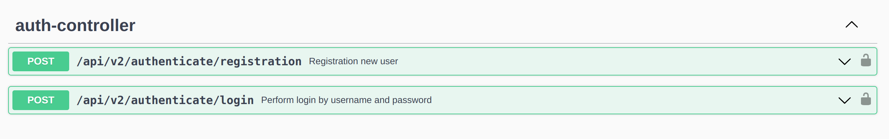
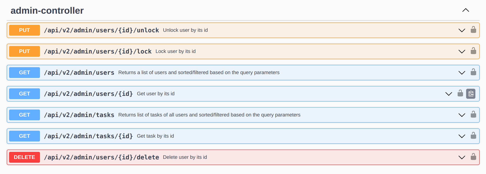
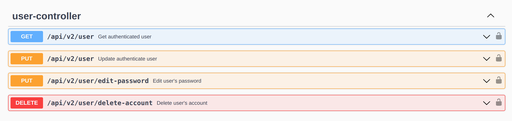
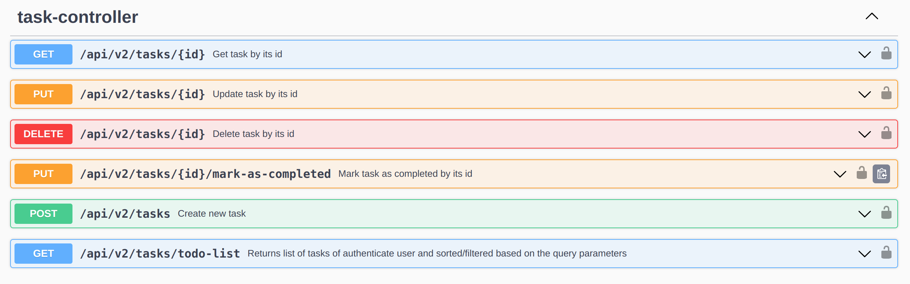

# Приложение todo-list-rest

## Цель проекта

___Основное предназначение этого приложения___ - 
это помощь пользователям в создании, организации и отслеживании 
списка дел и задач, которые им нужно выполнить. Приложение 
позволяет пользователям легко добавлять новые задачи, 
устанавливать сроки выполнения, 
отмечать выполненные задачи и просматривать 
всю свою рабочую нагрузку на одном удобном месте. 
"Todo-list-rest" помогает пользователям оставаться организованными,
планировать свое рабочее время и повышать эффективность 
выполнения задач. 

## Технологии 
Приложение представлено в виде сервиса, который принимает 
HTTP-запросы и возвращает ответы в json формате.

___Проект написан на Java с использованием:___
* Spring framework (Core, Data Jpa, Validation, Security, Boot, Test)
* Gradle
* H2 Database (можно переключиться на PostgreSQL)
* Liquibase
* Junit5 (unit, integration tests - около 250 тестов на приложение)

___В проекте реализовано:___
* Постраничное разбиение (pagination)
* Аудит изменения данных

## Документация
Документация по проекту будет доступна после запуска 
приложения по ссылке http://localhost:8080/swagger. 
1. Регистрация нового пользователя и авторизация существующего (JWT-token: роли ADMIN и USER):
   
2. Расширенные возможности у пользователя с ролью ADMIN:
   
3. Вывод информации о пользователе, изменение и удаление:
   
4. Создание, получение, изменение и удаление задач:
   

## Установка и использование
* Клонируйте этот репозиторий. 
* Откройте проект в своей IDE. 
* Запустите приложение. 
* Перейдите по ссылке http://localhost:8080/swagger.

## В базе данных проекта предустановленны пользователи:

___Ввести в auth-controller -> login:___
* { "username": "Admin", "password": "Admin" } роль ADMIN
* { "username": "Ivan", "password": "Ivan" } роль USER
* { "username": "Katya", "password": "Katya" } роль USER

